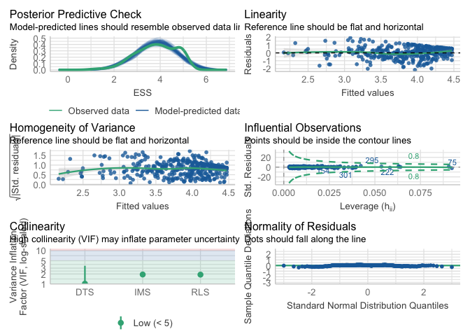
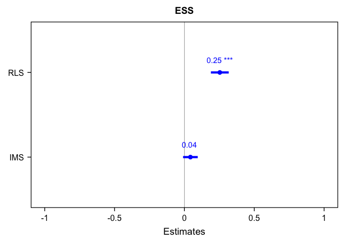
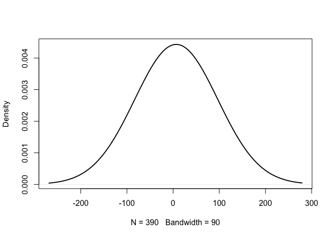
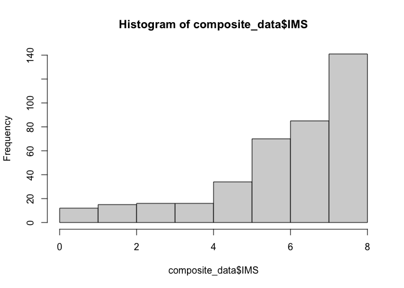
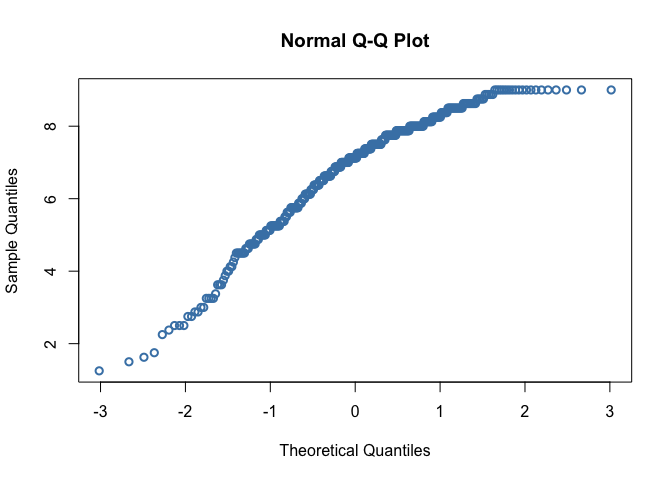
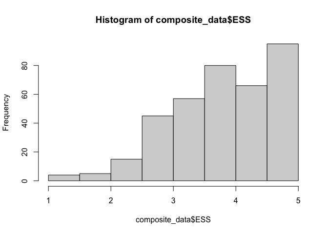

Lab6
================
Toko Michioka
2024-10-10

\#changes to only this file, not the original file will be reflected in
the github website

``` r
library(haven)
library(dplyr)
```

    ## 
    ## Attaching package: 'dplyr'

    ## The following objects are masked from 'package:stats':
    ## 
    ##     filter, lag

    ## The following objects are masked from 'package:base':
    ## 
    ##     intersect, setdiff, setequal, union

``` r
library(ggplot2)

data = read.csv("/Users/toko/Desktop/UofT/2024/Fall/PSY329/My project/Self-disclosure and Health Study 1_cleaned.csv")

# Re-coding: Re-code gender identity, sex at birth, race/ethnicity, partner’s gender identity and combine them into one column
combined_data <- data %>%
  mutate(Gender = case_when(
    G_Male == 1 ~ "Male",
    G_Female == 1 ~ "Female",
    G_FTM == 1 ~ "FTM",
    G_MTF == 1 ~ "MTF",
    G_Genderqueer == 1 ~ "Genderqueer",
    G_other == 1 ~ "Other",
    G_decline == 1 ~ "Decline")) %>%
  
  mutate(Partner_Gender = case_when(
    Partner_G_Male == 1 ~ "Male",
    Partner_G_Female == 1 ~ "Female",
    Partner_G_FTM == 1 ~ "FTM",
    Partner_G_MTF == 1 ~ "MTF",
    Partner_G_Genderqueer == 1 ~ "Genderqueer",
    Partner_G_Other == 1 ~ "Other",
    Partner_G_decline == 1 ~ "Decline")) %>%
  
  mutate(Sex = recode(Sex, "1" = "Male", "2" = "Female")) %>%
  
  mutate(Race = case_when(
    R_White == 1 ~ "White",
    R_Black == 1 ~ "Black",
    R_Hispanic == 1 ~ "Hispanic",
    R_NativeAmerican == 1 ~ "NativeAmerican",
    R_Asian == 1 ~ "Asian",
    R_Pacific == 1 ~ "Pacific",
    R_Arab == 1 ~ "Arab",
    R_Other == 1 ~ "Other"))

new_data <- combined_data %>%
  select(LOVE1, LOVE2, LOVE3, LOVE4, LOVE5, LOVE6, LOVE7, LOVE8, Satisfaction_global1, Satisfaction_global2, Satisfaction_global3, Satisfaction_global4, Satisfaction_global5, Time_together, SelfDisclosure1, SelfDisclosure2, SelfDisclosure3, SelfDisclosure4, SelfDisclosure5, SelfDisclosure6, SelfDisclosure7, SelfDisclosure8, SelfDisclosure9, SelfDisclosure10, SelfDisclosure11, SelfDisclosure12, SelfDisclosure13, SelfDisclosure14, SelfDisclosure15, SelfDisclosure16, SelfDisclosure17, SelfDisclosure18, SelfDisclosure19, SelfDisclosure20, SelfDisclosure21, SelfDisclosure22, SelfDisclosure23, SelfDisclosure24, SelfDisclosure25, SelfDisclosure26, SelfDisclosure27, SelfDisclosure28, SelfDisclosure29, SelfDisclosure30, SelfDisclosure31, SelfDisclosure32, SelfDisclosure33, SelfDisclosure34, SelfDisclosure35, SelfDisclosure36, SelfDisclosure37, SelfDisclosure38, SelfDisclosure39, SelfDisclosure40, Gender, Sex, Partner_Gender, Race)

#make composites (Romantic Love Scale (SLC), Investment Model Scale (IMS), Emotional Self-Disclosure Scale (ESS))
composite_data <- new_data %>%
  mutate(RLS = rowMeans(cbind(LOVE1, LOVE2, LOVE3, LOVE4, LOVE5, LOVE6, LOVE7, LOVE8)),
         IMS = rowMeans(cbind(Satisfaction_global1, Satisfaction_global2, Satisfaction_global3, Satisfaction_global4, Satisfaction_global5)),
         ESS = rowMeans(cbind(SelfDisclosure1, SelfDisclosure2, SelfDisclosure3, SelfDisclosure4, SelfDisclosure5, SelfDisclosure6, SelfDisclosure7, SelfDisclosure8, SelfDisclosure9, SelfDisclosure10, SelfDisclosure11, SelfDisclosure12, SelfDisclosure13, SelfDisclosure14, SelfDisclosure15, SelfDisclosure16, SelfDisclosure17, SelfDisclosure18, SelfDisclosure19, SelfDisclosure20, SelfDisclosure21, SelfDisclosure22, SelfDisclosure23, SelfDisclosure24, SelfDisclosure25, SelfDisclosure26, SelfDisclosure27, SelfDisclosure28, SelfDisclosure29, SelfDisclosure30, SelfDisclosure31, SelfDisclosure32, SelfDisclosure33, SelfDisclosure34, SelfDisclosure35, SelfDisclosure36, SelfDisclosure37, SelfDisclosure38, SelfDisclosure39, SelfDisclosure40)))
```

``` r
#normality plots
hist(composite_data$RLS)
```

<!-- -->

``` r
qqnorm(composite_data$RLS, col = "steelblue", lwd = 2)
```

<!-- -->

``` r
plot(density(composite_data$RLS, na.rm = TRUE, bw = 90),  lwd=2, main = "")
```

<!-- -->

``` r
hist(composite_data$IMS)
```

<!-- -->

``` r
qqnorm(composite_data$RLS, col = "steelblue", lwd = 2)
```

<!-- -->

``` r
plot(density(composite_data$RLS, na.rm = TRUE, bw = 90),  lwd=2, main = "")
```

<!-- -->

``` r
hist(composite_data$ESS)
```

<!-- -->

``` r
qqnorm(composite_data$RLS, col = "steelblue", lwd = 2)
```

<!-- -->

``` r
plot(density(composite_data$RLS, na.rm = TRUE, bw = 90),  lwd=2, main = "")
```

<!-- -->

``` r
#normality tests
shapiro.test(composite_data$RLS)
```

    ## 
    ##  Shapiro-Wilk normality test
    ## 
    ## data:  composite_data$RLS
    ## W = 0.92784, p-value = 8.946e-13

``` r
shapiro.test(composite_data$IMS)
```

    ## 
    ##  Shapiro-Wilk normality test
    ## 
    ## data:  composite_data$IMS
    ## W = 0.86411, p-value < 2.2e-16

``` r
shapiro.test(composite_data$ESS)
```

    ## 
    ##  Shapiro-Wilk normality test
    ## 
    ## data:  composite_data$ESS
    ## W = 0.95637, p-value = 5.689e-09
