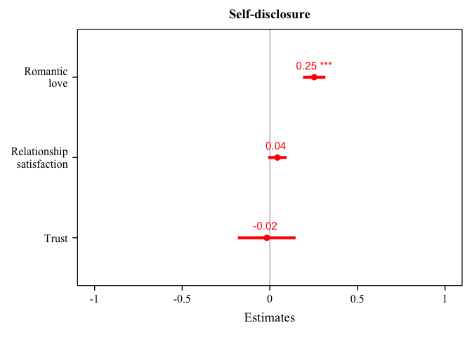

Lab6
================
Toko Michioka
2024-10-10

\#changes to only this file, not the original file will be reflected in
the github website

``` r
library(haven)
library(dplyr)
```

    ## 
    ## Attaching package: 'dplyr'

    ## The following objects are masked from 'package:stats':
    ## 
    ##     filter, lag

    ## The following objects are masked from 'package:base':
    ## 
    ##     intersect, setdiff, setequal, union

``` r
library(ggplot2)
library(psych)
```

    ## 
    ## Attaching package: 'psych'

    ## The following objects are masked from 'package:ggplot2':
    ## 
    ##     %+%, alpha

``` r
library(performance)
library(sjPlot)
library(bruceR)
```

    ## 
    ## bruceR (v2024.6)
    ## Broadly Useful Convenient and Efficient R functions
    ## 
    ## Packages also loaded:
    ## ✔ data.table ✔ emmeans
    ## ✔ dplyr      ✔ lmerTest
    ## ✔ tidyr      ✔ effectsize
    ## ✔ stringr    ✔ performance
    ## ✔ ggplot2    ✔ interactions
    ## 
    ## Main functions of `bruceR`:
    ## cc()             Describe()  TTEST()
    ## add()            Freq()      MANOVA()
    ## .mean()          Corr()      EMMEANS()
    ## set.wd()         Alpha()     PROCESS()
    ## import()         EFA()       model_summary()
    ## print_table()    CFA()       lavaan_summary()
    ## 
    ## For full functionality, please install all dependencies:
    ## install.packages("bruceR", dep=TRUE)
    ## 
    ## Online documentation:
    ## https://psychbruce.github.io/bruceR
    ## 
    ## To use this package in publications, please cite:
    ## Bao, H.-W.-S. (2024). bruceR: Broadly useful convenient and efficient R functions (Version 2024.6) [Computer software]. https://CRAN.R-project.org/package=bruceR

    ## 
    ## These packages are dependencies of `bruceR` but not installed:
    ## - pacman, openxlsx, ggtext, lmtest, vars, phia, MuMIn, GGally
    ## 
    ## ***** Install all dependencies *****
    ## install.packages("bruceR", dep=TRUE)

``` r
library(tidyverse)
```

    ## ── Attaching core tidyverse packages ──────────────────────── tidyverse 2.0.0 ──
    ## ✔ forcats   1.0.0     ✔ readr     2.1.5
    ## ✔ lubridate 1.9.3     ✔ tibble    3.2.1
    ## ✔ purrr     1.0.2

    ## ── Conflicts ────────────────────────────────────────── tidyverse_conflicts() ──
    ## ✖ psych::%+%()          masks ggplot2::%+%()
    ## ✖ psych::alpha()        masks ggplot2::alpha()
    ## ✖ data.table::between() masks dplyr::between()
    ## ✖ Matrix::expand()      masks tidyr::expand()
    ## ✖ dplyr::filter()       masks stats::filter()
    ## ✖ data.table::first()   masks dplyr::first()
    ## ✖ lubridate::hour()     masks data.table::hour()
    ## ✖ lubridate::isoweek()  masks data.table::isoweek()
    ## ✖ dplyr::lag()          masks stats::lag()
    ## ✖ data.table::last()    masks dplyr::last()
    ## ✖ lubridate::mday()     masks data.table::mday()
    ## ✖ lubridate::minute()   masks data.table::minute()
    ## ✖ lubridate::month()    masks data.table::month()
    ## ✖ Matrix::pack()        masks tidyr::pack()
    ## ✖ lubridate::quarter()  masks data.table::quarter()
    ## ✖ lubridate::second()   masks data.table::second()
    ## ✖ purrr::transpose()    masks data.table::transpose()
    ## ✖ Matrix::unpack()      masks tidyr::unpack()
    ## ✖ lubridate::wday()     masks data.table::wday()
    ## ✖ lubridate::week()     masks data.table::week()
    ## ✖ lubridate::yday()     masks data.table::yday()
    ## ✖ lubridate::year()     masks data.table::year()
    ## ℹ Use the conflicted package (<http://conflicted.r-lib.org/>) to force all conflicts to become errors

``` r
data = read.csv("/Users/toko/Desktop/UofT/2024/Fall/PSY329/My project/Self-disclosure and Health Study 1_cleaned.csv")

# Re-coding: Re-code gender identity, sex at birth, race/ethnicity, partner’s gender identity and combine them into one column
combined_data <- data %>%
  mutate(Gender = case_when(
    G_Male == 1 ~ "Male",
    G_Female == 1 ~ "Female",
    G_FTM == 1 ~ "FTM",
    G_MTF == 1 ~ "MTF",
    G_Genderqueer == 1 ~ "Genderqueer",
    G_other == 1 ~ "Other",
    G_decline == 1 ~ "Decline")) %>%
  
  mutate(Partner_Gender = case_when(
    Partner_G_Male == 1 ~ "Male",
    Partner_G_Female == 1 ~ "Female",
    Partner_G_FTM == 1 ~ "FTM",
    Partner_G_MTF == 1 ~ "MTF",
    Partner_G_Genderqueer == 1 ~ "Genderqueer",
    Partner_G_Other == 1 ~ "Other",
    Partner_G_decline == 1 ~ "Decline")) %>%
  
  mutate(Sex = recode(Sex, "1" = "Male", "2" = "Female")) %>%
  
  mutate(Race = case_when(
    R_White == 1 ~ "White",
    R_Black == 1 ~ "Black",
    R_Hispanic == 1 ~ "Hispanic",
    R_NativeAmerican == 1 ~ "NativeAmerican",
    R_Asian == 1 ~ "Asian",
    R_Pacific == 1 ~ "Pacific",
    R_Arab == 1 ~ "Arab",
    R_Other == 1 ~ "Other"))

new_data <- combined_data %>%
  select(LOVE1, LOVE2, LOVE3, LOVE4, LOVE5, LOVE6, LOVE7, LOVE8, Satisfaction_global1, Satisfaction_global2, Satisfaction_global3, Satisfaction_global4, Satisfaction_global5, Time_together, SelfDisclosure1, SelfDisclosure2, SelfDisclosure3, SelfDisclosure4, SelfDisclosure5, SelfDisclosure6, SelfDisclosure7, SelfDisclosure8, SelfDisclosure9, SelfDisclosure10, SelfDisclosure11, SelfDisclosure12, SelfDisclosure13, SelfDisclosure14, SelfDisclosure15, SelfDisclosure16, SelfDisclosure17, SelfDisclosure18, SelfDisclosure19, SelfDisclosure20, SelfDisclosure21, SelfDisclosure22, SelfDisclosure23, SelfDisclosure24, SelfDisclosure25, SelfDisclosure26, SelfDisclosure27, SelfDisclosure28, SelfDisclosure29, SelfDisclosure30, SelfDisclosure31, SelfDisclosure32, SelfDisclosure33, SelfDisclosure34, SelfDisclosure35, SelfDisclosure36, SelfDisclosure37, SelfDisclosure38, SelfDisclosure39, SelfDisclosure40, Gender, Sex, Partner_Gender, Race, Time_together)

#make composites (Romantic Love Scale (RLS), Investment Model Scale (IMS), Emotional Self-Disclosure Scale (ESS))
composite_data <- new_data %>%
  mutate(RLS = rowMeans(cbind(LOVE1, LOVE2, LOVE3, LOVE4, LOVE5, LOVE6, LOVE7, LOVE8)),
         IMS = rowMeans(cbind(Satisfaction_global1, Satisfaction_global2, Satisfaction_global3, Satisfaction_global4, Satisfaction_global5)),
         ESS = rowMeans(cbind(SelfDisclosure1, SelfDisclosure2, SelfDisclosure3, SelfDisclosure4, SelfDisclosure5, SelfDisclosure6, SelfDisclosure7, SelfDisclosure8, SelfDisclosure9, SelfDisclosure10, SelfDisclosure11, SelfDisclosure12, SelfDisclosure13, SelfDisclosure14, SelfDisclosure15, SelfDisclosure16, SelfDisclosure17, SelfDisclosure18, SelfDisclosure19, SelfDisclosure20, SelfDisclosure21, SelfDisclosure22, SelfDisclosure23, SelfDisclosure24, SelfDisclosure25, SelfDisclosure26, SelfDisclosure27, SelfDisclosure28, SelfDisclosure29, SelfDisclosure30, SelfDisclosure31, SelfDisclosure32, SelfDisclosure33, SelfDisclosure34, SelfDisclosure35, SelfDisclosure36, SelfDisclosure37, SelfDisclosure38, SelfDisclosure39, SelfDisclosure40)))
  
#removing n/a
composite_clean_data <- na.omit(composite_data)
```

``` r
mo<- lm(data = composite_clean_data, ESS ~ RLS + IMS )

check_model(mo)
```

<!-- -->

``` r
model_summary(mo)
```

    ## 
    ## Model Summary
    ## 
    ## ────────────────────────
    ##              (1) ESS    
    ## ────────────────────────
    ## (Intercept)    1.847 ***
    ##               (0.164)   
    ## RLS            0.253 ***
    ##               (0.032)   
    ## IMS            0.043    
    ##               (0.027)   
    ## ────────────────────────
    ## R^2            0.304    
    ## Adj. R^2       0.300    
    ## Num. obs.    355        
    ## ────────────────────────
    ## Note. * p < .05, ** p < .01, *** p < .001.
    ## 
    ## # Check for Multicollinearity
    ## 
    ## Low Correlation
    ## 
    ##  Term  VIF   VIF 95% CI Increased SE Tolerance Tolerance 95% CI
    ##   RLS 1.91 [1.66, 2.25]         1.38      0.52     [0.44, 0.60]
    ##   IMS 1.91 [1.66, 2.25]         1.38      0.52     [0.44, 0.60]

``` r
plot_model(mo,  type ="est",  show.values = TRUE, vline.color = "#1B191999", line.size = 1.5, dot.size = 2.5, colors = "blue") + theme_bruce()
```

<!-- -->

``` r
mo2<-lm(data = composite_clean_data, ESS ~ RLS + IMS + Race + Gender)

model_summary(mo2)
```

    ## 
    ## Model Summary
    ## 
    ## ──────────────────────────────
    ##                    (1) ESS    
    ## ──────────────────────────────
    ## (Intercept)          0.503    
    ##                     (0.889)   
    ## RLS                  0.256 ***
    ##                     (0.032)   
    ## IMS                  0.039    
    ##                     (0.026)   
    ## RaceBlack           -0.057    
    ##                     (0.176)   
    ## RaceHispanic         0.203    
    ##                     (0.231)   
    ## RaceOther            0.480    
    ##                     (0.516)   
    ## RaceWhite            0.052    
    ##                     (0.130)   
    ## GenderFemale         1.408    
    ##                     (0.870)   
    ## GenderFTM            1.473    
    ##                     (1.121)   
    ## GenderGenderqueer    2.010 *  
    ##                     (0.964)   
    ## GenderMale           1.053    
    ##                     (0.874)   
    ## ──────────────────────────────
    ## R^2                  0.353    
    ## Adj. R^2             0.335    
    ## Num. obs.          355        
    ## ──────────────────────────────
    ## Note. * p < .05, ** p < .01, *** p < .001.
    ## 
    ## # Check for Multicollinearity
    ## 
    ## Low Correlation
    ## 
    ##    Term  VIF   VIF 95% CI Increased SE Tolerance Tolerance 95% CI
    ##     RLS 1.94 [1.69, 2.27]         1.39      0.52     [0.44, 0.59]
    ##     IMS 1.94 [1.70, 2.28]         1.39      0.51     [0.44, 0.59]
    ##    Race 1.55 [1.37, 1.80]         1.24      0.65     [0.56, 0.73]
    ##  Gender 1.55 [1.37, 1.80]         1.24      0.65     [0.56, 0.73]

``` r
tab_model(mo2)
```

<table style="border-collapse:collapse; border:none;">
<tr>
<th style="border-top: double; text-align:center; font-style:normal; font-weight:bold; padding:0.2cm;  text-align:left; ">
 
</th>
<th colspan="3" style="border-top: double; text-align:center; font-style:normal; font-weight:bold; padding:0.2cm; ">
ESS
</th>
</tr>
<tr>
<td style=" text-align:center; border-bottom:1px solid; font-style:italic; font-weight:normal;  text-align:left; ">
Predictors
</td>
<td style=" text-align:center; border-bottom:1px solid; font-style:italic; font-weight:normal;  ">
Estimates
</td>
<td style=" text-align:center; border-bottom:1px solid; font-style:italic; font-weight:normal;  ">
CI
</td>
<td style=" text-align:center; border-bottom:1px solid; font-style:italic; font-weight:normal;  ">
p
</td>
</tr>
<tr>
<td style=" padding:0.2cm; text-align:left; vertical-align:top; text-align:left; ">
(Intercept)
</td>
<td style=" padding:0.2cm; text-align:left; vertical-align:top; text-align:center;  ">
0.50
</td>
<td style=" padding:0.2cm; text-align:left; vertical-align:top; text-align:center;  ">
-1.25 – 2.25
</td>
<td style=" padding:0.2cm; text-align:left; vertical-align:top; text-align:center;  ">
0.572
</td>
</tr>
<tr>
<td style=" padding:0.2cm; text-align:left; vertical-align:top; text-align:left; ">
RLS
</td>
<td style=" padding:0.2cm; text-align:left; vertical-align:top; text-align:center;  ">
0.26
</td>
<td style=" padding:0.2cm; text-align:left; vertical-align:top; text-align:center;  ">
0.19 – 0.32
</td>
<td style=" padding:0.2cm; text-align:left; vertical-align:top; text-align:center;  ">
<strong>\<0.001</strong>
</td>
</tr>
<tr>
<td style=" padding:0.2cm; text-align:left; vertical-align:top; text-align:left; ">
IMS
</td>
<td style=" padding:0.2cm; text-align:left; vertical-align:top; text-align:center;  ">
0.04
</td>
<td style=" padding:0.2cm; text-align:left; vertical-align:top; text-align:center;  ">
-0.01 – 0.09
</td>
<td style=" padding:0.2cm; text-align:left; vertical-align:top; text-align:center;  ">
0.134
</td>
</tr>
<tr>
<td style=" padding:0.2cm; text-align:left; vertical-align:top; text-align:left; ">
Race \[Black\]
</td>
<td style=" padding:0.2cm; text-align:left; vertical-align:top; text-align:center;  ">
-0.06
</td>
<td style=" padding:0.2cm; text-align:left; vertical-align:top; text-align:center;  ">
-0.40 – 0.29
</td>
<td style=" padding:0.2cm; text-align:left; vertical-align:top; text-align:center;  ">
0.747
</td>
</tr>
<tr>
<td style=" padding:0.2cm; text-align:left; vertical-align:top; text-align:left; ">
Race \[Hispanic\]
</td>
<td style=" padding:0.2cm; text-align:left; vertical-align:top; text-align:center;  ">
0.20
</td>
<td style=" padding:0.2cm; text-align:left; vertical-align:top; text-align:center;  ">
-0.25 – 0.66
</td>
<td style=" padding:0.2cm; text-align:left; vertical-align:top; text-align:center;  ">
0.381
</td>
</tr>
<tr>
<td style=" padding:0.2cm; text-align:left; vertical-align:top; text-align:left; ">
Race \[Other\]
</td>
<td style=" padding:0.2cm; text-align:left; vertical-align:top; text-align:center;  ">
0.48
</td>
<td style=" padding:0.2cm; text-align:left; vertical-align:top; text-align:center;  ">
-0.53 – 1.50
</td>
<td style=" padding:0.2cm; text-align:left; vertical-align:top; text-align:center;  ">
0.353
</td>
</tr>
<tr>
<td style=" padding:0.2cm; text-align:left; vertical-align:top; text-align:left; ">
Race \[White\]
</td>
<td style=" padding:0.2cm; text-align:left; vertical-align:top; text-align:center;  ">
0.05
</td>
<td style=" padding:0.2cm; text-align:left; vertical-align:top; text-align:center;  ">
-0.20 – 0.31
</td>
<td style=" padding:0.2cm; text-align:left; vertical-align:top; text-align:center;  ">
0.689
</td>
</tr>
<tr>
<td style=" padding:0.2cm; text-align:left; vertical-align:top; text-align:left; ">
Gender \[Female\]
</td>
<td style=" padding:0.2cm; text-align:left; vertical-align:top; text-align:center;  ">
1.41
</td>
<td style=" padding:0.2cm; text-align:left; vertical-align:top; text-align:center;  ">
-0.30 – 3.12
</td>
<td style=" padding:0.2cm; text-align:left; vertical-align:top; text-align:center;  ">
0.107
</td>
</tr>
<tr>
<td style=" padding:0.2cm; text-align:left; vertical-align:top; text-align:left; ">
Gender \[FTM\]
</td>
<td style=" padding:0.2cm; text-align:left; vertical-align:top; text-align:center;  ">
1.47
</td>
<td style=" padding:0.2cm; text-align:left; vertical-align:top; text-align:center;  ">
-0.73 – 3.68
</td>
<td style=" padding:0.2cm; text-align:left; vertical-align:top; text-align:center;  ">
0.190
</td>
</tr>
<tr>
<td style=" padding:0.2cm; text-align:left; vertical-align:top; text-align:left; ">
Gender \[Genderqueer\]
</td>
<td style=" padding:0.2cm; text-align:left; vertical-align:top; text-align:center;  ">
2.01
</td>
<td style=" padding:0.2cm; text-align:left; vertical-align:top; text-align:center;  ">
0.11 – 3.91
</td>
<td style=" padding:0.2cm; text-align:left; vertical-align:top; text-align:center;  ">
<strong>0.038</strong>
</td>
</tr>
<tr>
<td style=" padding:0.2cm; text-align:left; vertical-align:top; text-align:left; ">
Gender \[Male\]
</td>
<td style=" padding:0.2cm; text-align:left; vertical-align:top; text-align:center;  ">
1.05
</td>
<td style=" padding:0.2cm; text-align:left; vertical-align:top; text-align:center;  ">
-0.67 – 2.77
</td>
<td style=" padding:0.2cm; text-align:left; vertical-align:top; text-align:center;  ">
0.230
</td>
</tr>
<tr>
<td style=" padding:0.2cm; text-align:left; vertical-align:top; text-align:left; padding-top:0.1cm; padding-bottom:0.1cm; border-top:1px solid;">
Observations
</td>
<td style=" padding:0.2cm; text-align:left; vertical-align:top; padding-top:0.1cm; padding-bottom:0.1cm; text-align:left; border-top:1px solid;" colspan="3">
355
</td>
</tr>
<tr>
<td style=" padding:0.2cm; text-align:left; vertical-align:top; text-align:left; padding-top:0.1cm; padding-bottom:0.1cm;">
R<sup>2</sup> / R<sup>2</sup> adjusted
</td>
<td style=" padding:0.2cm; text-align:left; vertical-align:top; padding-top:0.1cm; padding-bottom:0.1cm; text-align:left;" colspan="3">
0.353 / 0.335
</td>
</tr>
</table>

``` r
plot_model(mo2,  type ="est",  show.values = TRUE, vline.color = "#1B191999", line.size = 1.5, dot.size = 2.5, colors = "blue") + theme_bruce()
```

<!-- -->

``` r
PROCESS(composite_clean_data, y = "ESS", x = "RLS", mods = c("Gender"))
```

    ## 
    ## ****************** PART 1. Regression Model Summary ******************
    ## 
    ## PROCESS Model Code : 1 (Hayes, 2018; www.guilford.com/p/hayes3)
    ## PROCESS Model Type : Simple Moderation
    ## -    Outcome (Y) : ESS
    ## -  Predictor (X) : RLS
    ## -  Mediators (M) : -
    ## - Moderators (W) : Gender
    ## - Covariates (C) : -
    ## -   HLM Clusters : -
    ## 
    ## All numeric predictors have been grand-mean centered.
    ## (For details, please see the help page of PROCESS.)
    ## 
    ## Formula of Outcome:
    ## -    ESS ~ RLS*Gender
    ## 
    ## CAUTION:
    ##   Fixed effect (coef.) of a predictor involved in an interaction
    ##   denotes its "simple effect/slope" at the other predictor = 0.
    ##   Only when all predictors in an interaction are mean-centered
    ##   can the fixed effect denote the "main effect"!
    ##   
    ## Model Summary
    ## 
    ## ───────────────────────────────────────────────
    ##                        (1) ESS      (2) ESS    
    ## ───────────────────────────────────────────────
    ## (Intercept)              3.820 ***    2.825 ***
    ##                         (0.039)      (0.710)   
    ## RLS                      0.289 ***    0.278 ***
    ##                         (0.024)      (0.043)   
    ## GenderFemale                          1.105    
    ##                                      (0.712)   
    ## GenderFTM                             1.135    
    ##                                      (1.007)   
    ## GenderGenderqueer                     2.120 *  
    ##                                      (0.873)   
    ## GenderMale                            0.754    
    ##                                      (0.714)   
    ## RLS:GenderFemale                      0.019    
    ##                                      (0.051)   
    ## RLS:GenderGenderqueer                -0.887    
    ##                                      (0.705)   
    ## ───────────────────────────────────────────────
    ## R^2                      0.299        0.348    
    ## Adj. R^2                 0.297        0.335    
    ## Num. obs.              355          355        
    ## ───────────────────────────────────────────────
    ## Note. * p < .05, ** p < .01, *** p < .001.
    ## 
    ## ************ PART 2. Mediation/Moderation Effect Estimate ************
    ## 
    ## Package Use : ‘interactions’ (v1.2.0)
    ## Effect Type : Simple Moderation (Model 1)
    ## Sample Size : 355
    ## Random Seed : -
    ## Simulations : -
    ## 
    ## Interaction Effect on "ESS" (Y)
    ## ────────────────────────────────────
    ##                  F df1 df2     p    
    ## ────────────────────────────────────
    ## RLS * Gender  0.88   2 347  .414    
    ## ────────────────────────────────────
    ## 
    ## Simple Slopes: "RLS" (X) ==> "ESS" (Y)
    ## ────────────────────────────────────────────────────────────
    ##  "Gender"    Effect    S.E.      t     p            [95% CI]
    ## ────────────────────────────────────────────────────────────
    ##  Decline      0.278 (0.043)  6.484 <.001 *** [ 0.194, 0.363]
    ##  Female       0.297 (0.027) 10.903 <.001 *** [ 0.243, 0.351]
    ##  FTM          0.278 (0.043)  6.484 <.001 *** [ 0.194, 0.363]
    ##  Genderqueer -0.608 (0.703) -0.865  .388     [-1.992, 0.775]
    ##  Male         0.278 (0.043)  6.484 <.001 *** [ 0.194, 0.363]
    ## ────────────────────────────────────────────────────────────

``` r
PROCESS(composite_clean_data, y = "ESS", x = "RLS", mods = c("Partner_Gender"))
```

    ## 
    ## ****************** PART 1. Regression Model Summary ******************
    ## 
    ## PROCESS Model Code : 1 (Hayes, 2018; www.guilford.com/p/hayes3)
    ## PROCESS Model Type : Simple Moderation
    ## -    Outcome (Y) : ESS
    ## -  Predictor (X) : RLS
    ## -  Mediators (M) : -
    ## - Moderators (W) : Partner_Gender
    ## - Covariates (C) : -
    ## -   HLM Clusters : -
    ## 
    ## All numeric predictors have been grand-mean centered.
    ## (For details, please see the help page of PROCESS.)
    ## 
    ## Formula of Outcome:
    ## -    ESS ~ RLS*Partner_Gender
    ## 
    ## CAUTION:
    ##   Fixed effect (coef.) of a predictor involved in an interaction
    ##   denotes its "simple effect/slope" at the other predictor = 0.
    ##   Only when all predictors in an interaction are mean-centered
    ##   can the fixed effect denote the "main effect"!
    ##   
    ## Model Summary
    ## 
    ## ───────────────────────────────────────────────────
    ##                            (1) ESS      (2) ESS    
    ## ───────────────────────────────────────────────────
    ## (Intercept)                  3.820 ***    3.567 ***
    ##                             (0.039)      (0.064)   
    ## RLS                          0.289 ***    0.314 ***
    ##                             (0.024)      (0.042)   
    ## Partner_GenderGenderqueer                -0.010    
    ##                                          (0.713)   
    ## Partner_GenderMale                        0.387 ***
    ##                                          (0.079)   
    ## RLS:Partner_GenderMale                   -0.029    
    ##                                          (0.050)   
    ## ───────────────────────────────────────────────────
    ## R^2                          0.299        0.345    
    ## Adj. R^2                     0.297        0.337    
    ## Num. obs.                  355          355        
    ## ───────────────────────────────────────────────────
    ## Note. * p < .05, ** p < .01, *** p < .001.
    ## 
    ## ************ PART 2. Mediation/Moderation Effect Estimate ************
    ## 
    ## Package Use : ‘interactions’ (v1.2.0)
    ## Effect Type : Simple Moderation (Model 1)
    ## Sample Size : 355
    ## Random Seed : -
    ## Simulations : -
    ## 
    ## Interaction Effect on "ESS" (Y)
    ## ────────────────────────────────────────────
    ##                          F df1 df2     p    
    ## ────────────────────────────────────────────
    ## RLS * Partner_Gender  0.33   1 350  .566    
    ## ────────────────────────────────────────────
    ## 
    ## Simple Slopes: "RLS" (X) ==> "ESS" (Y)
    ## ────────────────────────────────────────────────────────────────
    ##  "Partner_Gender" Effect    S.E.      t     p           [95% CI]
    ## ────────────────────────────────────────────────────────────────
    ##  Female            0.314 (0.042)  7.447 <.001 *** [0.231, 0.397]
    ##  Genderqueer       0.285 (0.027) 10.428 <.001 *** [0.231, 0.339]
    ##  Male              0.285 (0.027) 10.428 <.001 *** [0.231, 0.339]
    ## ────────────────────────────────────────────────────────────────

``` r
PROCESS(composite_clean_data, y = "ESS", x = "RLS", mods = c("Race"))
```

    ## 
    ## ****************** PART 1. Regression Model Summary ******************
    ## 
    ## PROCESS Model Code : 1 (Hayes, 2018; www.guilford.com/p/hayes3)
    ## PROCESS Model Type : Simple Moderation
    ## -    Outcome (Y) : ESS
    ## -  Predictor (X) : RLS
    ## -  Mediators (M) : -
    ## - Moderators (W) : Race
    ## - Covariates (C) : -
    ## -   HLM Clusters : -
    ## 
    ## All numeric predictors have been grand-mean centered.
    ## (For details, please see the help page of PROCESS.)
    ## 
    ## Formula of Outcome:
    ## -    ESS ~ RLS*Race
    ## 
    ## CAUTION:
    ##   Fixed effect (coef.) of a predictor involved in an interaction
    ##   denotes its "simple effect/slope" at the other predictor = 0.
    ##   Only when all predictors in an interaction are mean-centered
    ##   can the fixed effect denote the "main effect"!
    ##   
    ## Model Summary
    ## 
    ## ──────────────────────────────────────────
    ##                   (1) ESS      (2) ESS    
    ## ──────────────────────────────────────────
    ## (Intercept)         3.820 ***    3.716 ***
    ##                    (0.039)      (0.130)   
    ## RLS                 0.289 ***    0.244 ** 
    ##                    (0.024)      (0.085)   
    ## RaceBlack                        0.061    
    ##                                 (0.186)   
    ## RaceHispanic                     0.225    
    ##                                 (0.240)   
    ## RaceOther                        2.455    
    ##                                 (1.642)   
    ## RaceWhite                        0.119    
    ##                                 (0.138)   
    ## RLS:RaceBlack                    0.166    
    ##                                 (0.113)   
    ## RLS:RaceHispanic                -0.051    
    ##                                 (0.139)   
    ## RLS:RaceOther                    1.911    
    ##                                 (1.283)   
    ## RLS:RaceWhite                    0.035    
    ##                                 (0.090)   
    ## ──────────────────────────────────────────
    ## R^2                 0.299        0.314    
    ## Adj. R^2            0.297        0.296    
    ## Num. obs.         355          355        
    ## ──────────────────────────────────────────
    ## Note. * p < .05, ** p < .01, *** p < .001.
    ## 
    ## ************ PART 2. Mediation/Moderation Effect Estimate ************
    ## 
    ## Package Use : ‘interactions’ (v1.2.0)
    ## Effect Type : Simple Moderation (Model 1)
    ## Sample Size : 355
    ## Random Seed : -
    ## Simulations : -
    ## 
    ## Interaction Effect on "ESS" (Y)
    ## ──────────────────────────────────
    ##                F df1 df2     p    
    ## ──────────────────────────────────
    ## RLS * Race  1.48   4 345  .208    
    ## ──────────────────────────────────
    ## 
    ## Simple Slopes: "RLS" (X) ==> "ESS" (Y)
    ## ─────────────────────────────────────────────────────────
    ##  "Race"   Effect    S.E.      t     p            [95% CI]
    ## ─────────────────────────────────────────────────────────
    ##  Asian     0.244 (0.085)  2.860  .004 **  [ 0.076, 0.412]
    ##  Black     0.410 (0.075)  5.489 <.001 *** [ 0.263, 0.557]
    ##  Hispanic  0.193 (0.110)  1.757  .080 .   [-0.023, 0.408]
    ##  Other     2.155 (1.280)  1.683  .093 .   [-0.363, 4.673]
    ##  White     0.279 (0.027) 10.318 <.001 *** [ 0.226, 0.333]
    ## ─────────────────────────────────────────────────────────

``` r
PROCESS(composite_clean_data, y = "ESS", x = "RLS", mods = c("Sex"))
```

    ## 
    ## ****************** PART 1. Regression Model Summary ******************
    ## 
    ## PROCESS Model Code : 1 (Hayes, 2018; www.guilford.com/p/hayes3)
    ## PROCESS Model Type : Simple Moderation
    ## -    Outcome (Y) : ESS
    ## -  Predictor (X) : RLS
    ## -  Mediators (M) : -
    ## - Moderators (W) : Sex
    ## - Covariates (C) : -
    ## -   HLM Clusters : -
    ## 
    ## All numeric predictors have been grand-mean centered.
    ## (For details, please see the help page of PROCESS.)
    ## 
    ## Formula of Outcome:
    ## -    ESS ~ RLS*Sex
    ## 
    ## CAUTION:
    ##   Fixed effect (coef.) of a predictor involved in an interaction
    ##   denotes its "simple effect/slope" at the other predictor = 0.
    ##   Only when all predictors in an interaction are mean-centered
    ##   can the fixed effect denote the "main effect"!
    ##   
    ## Model Summary
    ## 
    ## ─────────────────────────────────────
    ##              (1) ESS      (2) ESS    
    ## ─────────────────────────────────────
    ## (Intercept)    3.820 ***    3.936 ***
    ##               (0.039)      (0.046)   
    ## RLS            0.289 ***    0.297 ***
    ##               (0.024)      (0.027)   
    ## SexMale                    -0.357 ***
    ##                            (0.081)   
    ## RLS:SexMale                -0.014    
    ##                            (0.051)   
    ## ─────────────────────────────────────
    ## R^2            0.299        0.337    
    ## Adj. R^2       0.297        0.331    
    ## Num. obs.    355          355        
    ## ─────────────────────────────────────
    ## Note. * p < .05, ** p < .01, *** p < .001.
    ## 
    ## ************ PART 2. Mediation/Moderation Effect Estimate ************
    ## 
    ## Package Use : ‘interactions’ (v1.2.0)
    ## Effect Type : Simple Moderation (Model 1)
    ## Sample Size : 355
    ## Random Seed : -
    ## Simulations : -
    ## 
    ## Interaction Effect on "ESS" (Y)
    ## ─────────────────────────────────
    ##               F df1 df2     p    
    ## ─────────────────────────────────
    ## RLS * Sex  0.07   1 351  .785    
    ## ─────────────────────────────────
    ## 
    ## Simple Slopes: "RLS" (X) ==> "ESS" (Y)
    ## ──────────────────────────────────────────────────────
    ##  "Sex"  Effect    S.E.      t     p           [95% CI]
    ## ──────────────────────────────────────────────────────
    ##  Female  0.297 (0.027) 10.893 <.001 *** [0.244, 0.351]
    ##  Male    0.283 (0.043)  6.627 <.001 *** [0.199, 0.367]
    ## ──────────────────────────────────────────────────────

``` r
ggplot(composite_clean_data, aes(x = RLS, y = ESS)) + 
  geom_point() + 
  geom_smooth(method = lm) + 
  facet_wrap(~ Sex) + 
  theme_bruce()
```

    ## `geom_smooth()` using formula = 'y ~ x'

<!-- -->

``` r
ggplot(composite_clean_data, aes(x = RLS, y = ESS)) + 
  geom_point() + 
  geom_smooth(method = lm) + 
  facet_wrap(~ Partner_Gender) + 
  theme_bruce()
```

    ## `geom_smooth()` using formula = 'y ~ x'

<!-- -->

``` r
ggplot(composite_clean_data, aes(x = RLS, y = ESS)) + 
  geom_point() + 
  geom_smooth(method = lm) + 
  facet_wrap(~ Gender) + 
  theme_bruce()
```

    ## `geom_smooth()` using formula = 'y ~ x'

<!-- -->

``` r
ggplot(composite_clean_data, aes(x = RLS, y = ESS)) + 
  geom_point() + 
  geom_smooth(method = lm) + 
  facet_wrap(~ Race) + 
  theme_bruce()
```

    ## `geom_smooth()` using formula = 'y ~ x'

<!-- -->

``` r
#Cronbach's alpha for Romantic Love

Alpha(new_data, "LOVE", 1:8)
```

    ## 
    ## Reliability Analysis
    ## 
    ## Summary:
    ## Total Items: 8
    ## Scale Range: 1 ~ 9
    ## Total Cases: 393
    ## Valid Cases: 390 (99.2%)
    ## 
    ## Scale Statistics:
    ## Mean = 6.799
    ## S.D. = 1.616
    ## Cronbach’s α = 0.884
    ## McDonald’s ω = 0.895
    ## 
    ## Item Statistics (Cronbach’s α If Item Deleted):
    ## ────────────────────────────────────────────────
    ##         Mean    S.D. Item-Rest Cor. Cronbach’s α
    ## ────────────────────────────────────────────────
    ## LOVE1  7.492 (1.753)          0.699        0.867
    ## LOVE2  7.105 (2.112)          0.709        0.864
    ## LOVE3  5.926 (2.184)          0.578        0.877
    ## LOVE4  7.433 (1.954)          0.758        0.860
    ## LOVE5  5.408 (2.553)          0.443        0.895
    ## LOVE6  6.438 (2.609)          0.679        0.868
    ## LOVE7  7.236 (2.115)          0.768        0.858
    ## LOVE8  7.356 (1.976)          0.693        0.866
    ## ────────────────────────────────────────────────
    ## Item-Rest Cor. = Corrected Item-Total Correlation

``` r
#Cronbach's alpha for relationship satisfaction

Alpha(new_data, "Satisfaction_global", 1:5)
```

    ## 
    ## Reliability Analysis
    ## 
    ## Summary:
    ## Total Items: 5
    ## Scale Range: 0 ~ 8
    ## Total Cases: 393
    ## Valid Cases: 389 (99.0%)
    ## 
    ## Scale Statistics:
    ## Mean = 6.005
    ## S.D. = 1.979
    ## Cronbach’s α = 0.956
    ## McDonald’s ω = 0.957
    ## 
    ## Item Statistics (Cronbach’s α If Item Deleted):
    ## ───────────────────────────────────────────────────────────────
    ##                        Mean    S.D. Item-Rest Cor. Cronbach’s α
    ## ───────────────────────────────────────────────────────────────
    ## Satisfaction_global1  6.175 (2.065)          0.907        0.941
    ## Satisfaction_global2  5.686 (2.183)          0.819        0.955
    ## Satisfaction_global3  5.679 (2.300)          0.890        0.944
    ## Satisfaction_global4  6.337 (2.016)          0.915        0.940
    ## Satisfaction_global5  6.149 (2.158)          0.863        0.948
    ## ───────────────────────────────────────────────────────────────
    ## Item-Rest Cor. = Corrected Item-Total Correlation

``` r
#Cronbach's alpha for Self disclosure

Alpha(new_data, "SelfDisclosure", 1:40)
```

    ## 
    ## Reliability Analysis
    ## 
    ## Summary:
    ## Total Items: 40
    ## Scale Range: 1 ~ 5
    ## Total Cases: 393
    ## Valid Cases: 367 (93.4%)
    ## 
    ## Scale Statistics:
    ## Mean = 3.823
    ## S.D. = 0.863
    ## Cronbach’s α = 0.978
    ## McDonald’s ω = 0.978
    ## 
    ## Item Statistics (Cronbach’s α If Item Deleted):
    ## ───────────────────────────────────────────────────────────
    ##                    Mean    S.D. Item-Rest Cor. Cronbach’s α
    ## ───────────────────────────────────────────────────────────
    ## SelfDisclosure1   3.744 (1.221)          0.780        0.977
    ## SelfDisclosure2   4.534 (0.815)          0.558        0.978
    ## SelfDisclosure3   3.379 (1.314)          0.732        0.978
    ## SelfDisclosure4   3.790 (1.167)          0.779        0.977
    ## SelfDisclosure5   3.785 (1.210)          0.759        0.977
    ## SelfDisclosure6   4.223 (1.061)          0.549        0.978
    ## SelfDisclosure7   3.515 (1.297)          0.746        0.977
    ## SelfDisclosure8   3.777 (1.232)          0.791        0.977
    ## SelfDisclosure9   3.755 (1.235)          0.788        0.977
    ## SelfDisclosure10  4.460 (0.854)          0.629        0.978
    ## SelfDisclosure11  3.436 (1.270)          0.613        0.978
    ## SelfDisclosure12  3.965 (1.097)          0.745        0.978
    ## SelfDisclosure13  3.766 (1.199)          0.757        0.977
    ## SelfDisclosure14  3.676 (1.287)          0.639        0.978
    ## SelfDisclosure15  3.531 (1.282)          0.713        0.978
    ## SelfDisclosure16  3.793 (1.235)          0.770        0.977
    ## SelfDisclosure17  3.668 (1.241)          0.750        0.977
    ## SelfDisclosure18  4.406 (0.903)          0.600        0.978
    ## SelfDisclosure19  3.379 (1.302)          0.761        0.977
    ## SelfDisclosure20  4.052 (1.111)          0.739        0.978
    ## SelfDisclosure21  3.916 (1.119)          0.732        0.978
    ## SelfDisclosure22  4.147 (1.084)          0.642        0.978
    ## SelfDisclosure23  3.411 (1.323)          0.769        0.977
    ## SelfDisclosure24  3.820 (1.246)          0.759        0.977
    ## SelfDisclosure25  3.921 (1.139)          0.788        0.977
    ## SelfDisclosure26  4.401 (0.926)          0.606        0.978
    ## SelfDisclosure27  3.482 (1.232)          0.690        0.978
    ## SelfDisclosure28  3.787 (1.133)          0.793        0.977
    ## SelfDisclosure29  3.463 (1.311)          0.743        0.978
    ## SelfDisclosure30  4.136 (1.110)          0.674        0.978
    ## SelfDisclosure31  3.362 (1.325)          0.746        0.978
    ## SelfDisclosure32  3.820 (1.250)          0.795        0.977
    ## SelfDisclosure33  3.839 (1.149)          0.759        0.977
    ## SelfDisclosure34  4.482 (0.809)          0.591        0.978
    ## SelfDisclosure35  3.425 (1.234)          0.735        0.978
    ## SelfDisclosure36  3.749 (1.146)          0.793        0.977
    ## SelfDisclosure37  3.684 (1.245)          0.727        0.978
    ## SelfDisclosure38  4.283 (1.025)          0.602        0.978
    ## SelfDisclosure39  3.311 (1.350)          0.789        0.977
    ## SelfDisclosure40  3.850 (1.167)          0.803        0.977
    ## ───────────────────────────────────────────────────────────
    ## Item-Rest Cor. = Corrected Item-Total Correlation

``` r
EFA(new_data, "LOVE", 1:8, method = "pa", plot.scree = TRUE, nfactors = c("parallel"))
```

    ## 
    ## Explanatory Factor Analysis
    ## 
    ## Summary:
    ## Total Items: 8
    ## Scale Range: 1 ~ 9
    ## Total Cases: 393
    ## Valid Cases: 390 (99.2%)
    ## 
    ## Extraction Method:
    ## - Principal Axis Factor Analysis
    ## Rotation Method:
    ## - (Only one component was extracted. The solution was not rotated.)
    ## 
    ## KMO and Bartlett's Test:
    ## - Kaiser-Meyer-Olkin (KMO) Measure of Sampling Adequacy: MSA = 0.909
    ## - Bartlett's Test of Sphericity: Approx. χ²(28) = 1578.12, p < 1e-99 ***
    ## 
    ## Total Variance Explained:
    ## ───────────────────────────────────────────────────────────────────────────────
    ##           Eigenvalue Variance % Cumulative % SS Loading Variance % Cumulative %
    ## ───────────────────────────────────────────────────────────────────────────────
    ## Factor 1       4.623     57.784       57.784      4.186     52.322       52.322
    ## Factor 2       0.843     10.539       68.323                                   
    ## Factor 3       0.652      8.149       76.472                                   
    ## Factor 4       0.484      6.056       82.528                                   
    ## Factor 5       0.447      5.584       88.112                                   
    ## Factor 6       0.380      4.747       92.859                                   
    ## Factor 7       0.327      4.091       96.950                                   
    ## Factor 8       0.244      3.050      100.000                                   
    ## ───────────────────────────────────────────────────────────────────────────────
    ## 
    ## Factor Loadings (Sorted by Size):
    ## ────────────────────────
    ##          PA1 Communality
    ## ────────────────────────
    ## LOVE7  0.825       0.681
    ## LOVE4  0.822       0.675
    ## LOVE2  0.768       0.590
    ## LOVE1  0.768       0.590
    ## LOVE8  0.754       0.569
    ## LOVE6  0.710       0.504
    ## LOVE3  0.608       0.370
    ## LOVE5  0.455       0.207
    ## ────────────────────────
    ## Communality = Sum of Squared (SS) Factor Loadings
    ## (Uniqueness = 1 - Communality)

<!-- -->

``` r
EFA(new_data, "Satisfaction_global", 1:5, method = "pa", plot.scree = TRUE, nfactors = c("parallel"))
```

    ## 
    ## Explanatory Factor Analysis
    ## 
    ## Summary:
    ## Total Items: 5
    ## Scale Range: 0 ~ 8
    ## Total Cases: 393
    ## Valid Cases: 389 (99.0%)
    ## 
    ## Extraction Method:
    ## - Principal Axis Factor Analysis
    ## Rotation Method:
    ## - (Only one component was extracted. The solution was not rotated.)
    ## 
    ## KMO and Bartlett's Test:
    ## - Kaiser-Meyer-Olkin (KMO) Measure of Sampling Adequacy: MSA = 0.883
    ## - Bartlett's Test of Sphericity: Approx. χ²(10) = 2232.07, p < 1e-99 ***
    ## 
    ## Total Variance Explained:
    ## ───────────────────────────────────────────────────────────────────────────────
    ##           Eigenvalue Variance % Cumulative % SS Loading Variance % Cumulative %
    ## ───────────────────────────────────────────────────────────────────────────────
    ## Factor 1       4.266     85.330       85.330      4.089     81.779       81.779
    ## Factor 2       0.325      6.499       91.829                                   
    ## Factor 3       0.173      3.456       95.285                                   
    ## Factor 4       0.151      3.030       98.315                                   
    ## Factor 5       0.084      1.685      100.000                                   
    ## ───────────────────────────────────────────────────────────────────────────────
    ## 
    ## Factor Loadings (Sorted by Size):
    ## ───────────────────────────────────────
    ##                         PA1 Communality
    ## ───────────────────────────────────────
    ## Satisfaction_global4  0.945       0.893
    ## Satisfaction_global1  0.936       0.876
    ## Satisfaction_global3  0.912       0.833
    ## Satisfaction_global5  0.888       0.789
    ## Satisfaction_global2  0.836       0.698
    ## ───────────────────────────────────────
    ## Communality = Sum of Squared (SS) Factor Loadings
    ## (Uniqueness = 1 - Communality)

<!-- -->

``` r
EFA(new_data, "SelfDisclosure", 1:40, method = "pa", plot.scree = TRUE, nfactors = 1)
```

    ## 
    ## Explanatory Factor Analysis
    ## 
    ## Summary:
    ## Total Items: 40
    ## Scale Range: 1 ~ 5
    ## Total Cases: 393
    ## Valid Cases: 367 (93.4%)
    ## 
    ## Extraction Method:
    ## - Principal Axis Factor Analysis
    ## Rotation Method:
    ## - (Only one component was extracted. The solution was not rotated.)
    ## 
    ## KMO and Bartlett's Test:
    ## - Kaiser-Meyer-Olkin (KMO) Measure of Sampling Adequacy: MSA = 0.966
    ## - Bartlett's Test of Sphericity: Approx. χ²(780) = 14640.26, p < 1e-99 ***
    ## 
    ## Total Variance Explained:
    ## ────────────────────────────────────────────────────────────────────────────────
    ##            Eigenvalue Variance % Cumulative % SS Loading Variance % Cumulative %
    ## ────────────────────────────────────────────────────────────────────────────────
    ## Factor 1       21.770     54.425       54.425     21.323     53.306       53.306
    ## Factor 2        3.591      8.978       63.403                                   
    ## Factor 3        1.719      4.298       67.701                                   
    ## Factor 4        1.136      2.840       70.541                                   
    ## Factor 5        0.887      2.217       72.758                                   
    ## Factor 6        0.782      1.956       74.714                                   
    ## Factor 7        0.689      1.723       76.437                                   
    ## Factor 8        0.649      1.624       78.060                                   
    ## Factor 9        0.592      1.479       79.540                                   
    ## Factor 10       0.549      1.374       80.913                                   
    ## Factor 11       0.501      1.253       82.167                                   
    ## Factor 12       0.463      1.159       83.325                                   
    ## Factor 13       0.437      1.093       84.418                                   
    ## Factor 14       0.417      1.041       85.460                                   
    ## Factor 15       0.399      0.998       86.458                                   
    ## Factor 16       0.390      0.975       87.432                                   
    ## Factor 17       0.362      0.904       88.337                                   
    ## Factor 18       0.345      0.862       89.198                                   
    ## Factor 19       0.326      0.815       90.013                                   
    ## Factor 20       0.312      0.779       90.793                                   
    ## Factor 21       0.294      0.735       91.528                                   
    ## Factor 22       0.269      0.673       92.201                                   
    ## Factor 23       0.260      0.649       92.850                                   
    ## Factor 24       0.259      0.646       93.496                                   
    ## Factor 25       0.244      0.609       94.106                                   
    ## Factor 26       0.220      0.550       94.656                                   
    ## Factor 27       0.213      0.533       95.189                                   
    ## Factor 28       0.204      0.509       95.698                                   
    ## Factor 29       0.189      0.473       96.171                                   
    ## Factor 30       0.188      0.470       96.640                                   
    ## Factor 31       0.178      0.445       97.085                                   
    ## Factor 32       0.167      0.418       97.503                                   
    ## Factor 33       0.160      0.401       97.904                                   
    ## Factor 34       0.151      0.377       98.281                                   
    ## Factor 35       0.146      0.365       98.646                                   
    ## Factor 36       0.130      0.324       98.970                                   
    ## Factor 37       0.118      0.294       99.264                                   
    ## Factor 38       0.107      0.267       99.530                                   
    ## Factor 39       0.099      0.249       99.779                                   
    ## Factor 40       0.088      0.221      100.000                                   
    ## ────────────────────────────────────────────────────────────────────────────────
    ## 
    ## Factor Loadings (Sorted by Size):
    ## ───────────────────────────────────
    ##                     PA1 Communality
    ## ───────────────────────────────────
    ## SelfDisclosure40  0.814       0.662
    ## SelfDisclosure32  0.808       0.653
    ## SelfDisclosure8   0.803       0.645
    ## SelfDisclosure28  0.802       0.643
    ## SelfDisclosure36  0.801       0.642
    ## SelfDisclosure25  0.801       0.642
    ## SelfDisclosure9   0.801       0.641
    ## SelfDisclosure39  0.793       0.628
    ## SelfDisclosure4   0.790       0.624
    ## SelfDisclosure1   0.789       0.623
    ## SelfDisclosure16  0.783       0.612
    ## SelfDisclosure23  0.772       0.597
    ## SelfDisclosure24  0.772       0.595
    ## SelfDisclosure33  0.769       0.592
    ## SelfDisclosure5   0.768       0.590
    ## SelfDisclosure13  0.764       0.584
    ## SelfDisclosure19  0.763       0.583
    ## SelfDisclosure17  0.758       0.574
    ## SelfDisclosure12  0.754       0.569
    ## SelfDisclosure20  0.752       0.565
    ## SelfDisclosure31  0.750       0.563
    ## SelfDisclosure7   0.748       0.560
    ## SelfDisclosure29  0.748       0.559
    ## SelfDisclosure21  0.743       0.552
    ## SelfDisclosure35  0.739       0.546
    ## SelfDisclosure3   0.736       0.542
    ## SelfDisclosure37  0.734       0.539
    ## SelfDisclosure15  0.714       0.510
    ## SelfDisclosure27  0.695       0.483
    ## SelfDisclosure30  0.682       0.465
    ## SelfDisclosure22  0.649       0.422
    ## SelfDisclosure14  0.642       0.412
    ## SelfDisclosure10  0.638       0.407
    ## SelfDisclosure26  0.618       0.382
    ## SelfDisclosure11  0.615       0.378
    ## SelfDisclosure18  0.611       0.374
    ## SelfDisclosure38  0.608       0.370
    ## SelfDisclosure34  0.601       0.362
    ## SelfDisclosure2   0.568       0.323
    ## SelfDisclosure6   0.557       0.310
    ## ───────────────────────────────────
    ## Communality = Sum of Squared (SS) Factor Loadings
    ## (Uniqueness = 1 - Communality)

<!-- -->
